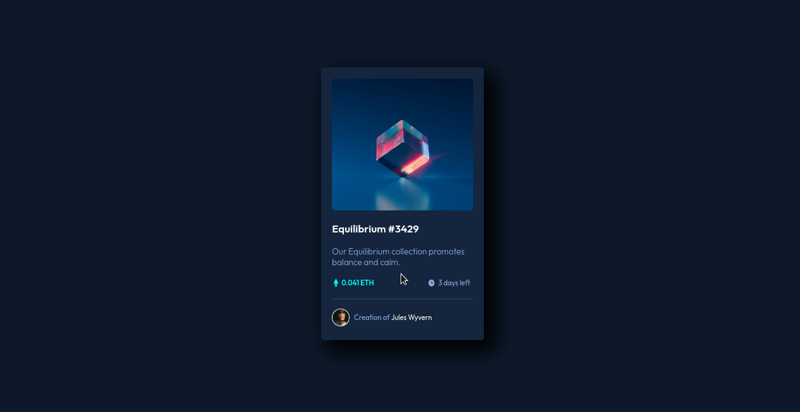

<h1>NFT Card</h1>

Project taken from the Front End Mentor challenge site, first developed with HTML and CSS, and currently implemented in ReactJS with Styled Components styling.

<h3>Used Technologies</h3>

<h2>Interface</h2>

> Developed with ❤️ by César Canoff
> 

